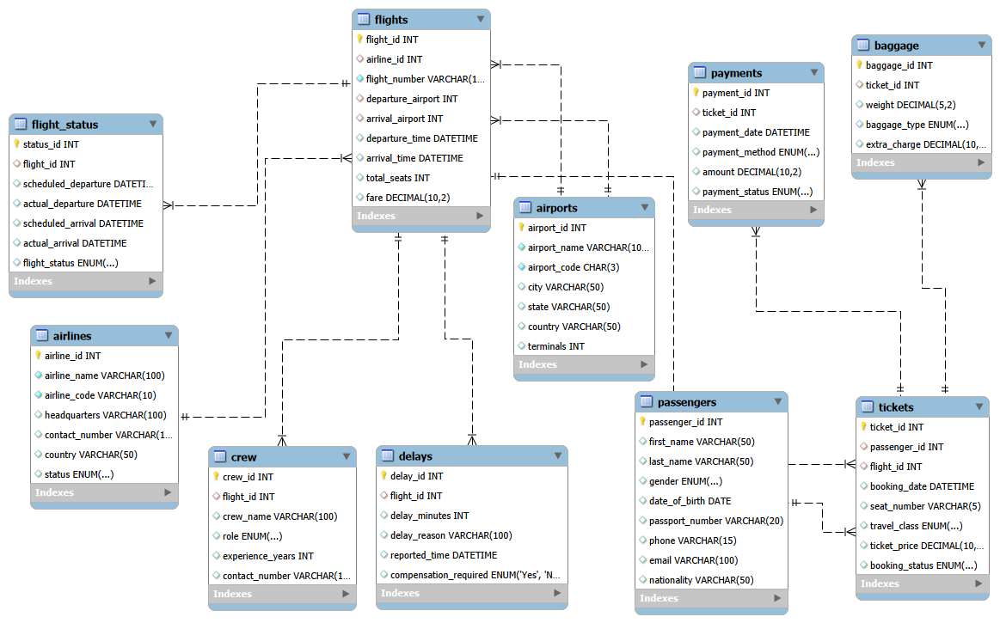

# Airline Reservation System


A MySQL-based Airline Reservation System developed to efficiently manage airline operations, including flight scheduling, passenger bookings, payments, baggage, crew management, flight status tracking, and delay analysis. This project demonstrates relational database design and advanced SQL concepts through a real-world use case.

---

## Overview

The Airline Reservation System is designed to streamline airline operations by maintaining structured records of airlines, airports, flights, passengers, ticket bookings, payments, baggage, crew members, flight status, and delays. The project emphasizes data integrity, efficient query execution, and relational database design using MySQL.

---

## Technologies Used

- MySQL
- MySQL Workbench
- SQL

---

## Key Features

- Airline Management
- Airport Management
- Flight Scheduling
- Passenger Management
- Ticket Booking
- Crew Management
- Payment Management
- Baggage Management
- Flight Status Tracking
- Flight Delay Analysis

---

## Database Tables

- Airlines
- Airports
- Flights
- Passengers
- Tickets
- Crew
- Flight_Status
- Payments
- Baggage
- Delays

---

## SQL Concepts Implemented

### Basic SQL
- SELECT
- WHERE
- ORDER BY
- LIMIT
- DISTINCT
- LIKE
- BETWEEN
- IN

### Aggregate Functions
- COUNT()
- SUM()
- AVG()
- MIN()
- MAX()
- GROUP BY
- HAVING

### Window Functions
- ROW_NUMBER()
- RANK()
- DENSE_RANK()

### Joins
- JOIN
- LEFT JOIN
- RIGHT JOIN

### Other Concepts
- Subqueries
- Views
- Constraints
- Primary Keys
- Foreign Keys

---

## Repository Structure

```text
Airline-Reservation-System/
│
├── Airline_Reservation_System.sql
├── Airline Reservation System.pptx
├── Airline ER Diagram.mwb
├── ER Diagram.pdf
├── README.md
└── ER Diagram.png
```

---

## Project Preview

### ER Diagram



### Sample Query Output


---

## Learning Outcomes

This project helped strengthen my understanding of:

- Relational Database Design
- Database Normalization
- Primary & Foreign Keys
- SQL Query Development
- Aggregate Functions
- Window Functions
- Joins
- Subqueries
- Views
- Data Integrity using Constraints

---

## Future Enhancements

- Online Seat Selection
- Ticket Cancellation & Refund Module
- User Authentication
- Real-Time Flight Tracking
- Power BI Dashboard Integration

---

## Author

**Srushti Khare**

- LinkedIn: https://www.linkedin.com/in/srushtikhare
- GitHub: https://github.com/SrushtiKhare

---

## License

This project is developed for educational and portfolio purposes.
